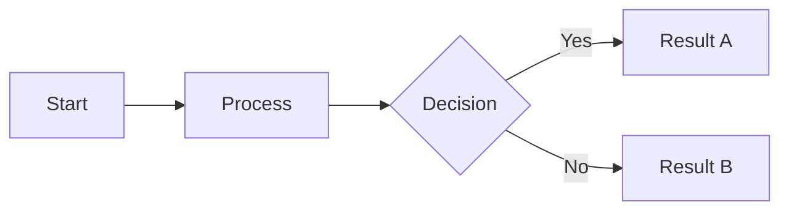
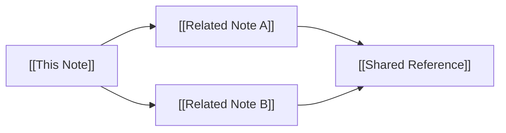

# Obsidian Flavored Markdown — Complete Specification Reference

> **Purpose:** Technical reference for generating `.md` files optimized for Obsidian vaults.
> Covers OFM syntax, properties/frontmatter, tags, graph optimization, Bases, search operators, and the official CLI.
> Obsidian extends CommonMark + GitHub Flavored Markdown (GFM) + LaTeX. Standard Markdown is assumed; this document covers Obsidian-specific extensions only.

---

## Table of Contents

1. [File Structure & Frontmatter](#1-file-structure--frontmatter)
2. [Properties (YAML Frontmatter)](#2-properties-yaml-frontmatter)
3. [Tags](#3-tags)
4. [Internal Links & Wikilinks](#4-internal-links--wikilinks)
5. [Embeds & Transclusion](#5-embeds--transclusion)
6. [Callouts](#6-callouts)
7. [Advanced Syntax](#7-advanced-syntax)
8. [Graph View Optimization](#8-graph-view-optimization)
9. [Bases (.base files)](#9-bases-base-files)
10. [Search Operators](#10-search-operators)
11. [Official CLI (v1.12+)](#11-official-cli-v112)
12. [Complete Note Template](#12-complete-note-template)

---

## 1. File Structure & Frontmatter

Every Obsidian note is a `.md` file. The canonical structure:

```
---
[YAML frontmatter block — must be first thing in file]
---

# Note Title

[Content]
```

**Rules:**
- Frontmatter MUST start at line 1, character 1 — no blank lines before the opening `---`
- The closing `---` must be on its own line
- Everything between the `---` delimiters is parsed as YAML
- If no frontmatter is needed, omit the block entirely — do not include empty `---\n---`

---

## 2. Properties (YAML Frontmatter)

Properties are structured metadata stored in YAML frontmatter. Introduced in Obsidian 1.4; supersedes raw YAML usage.

### 2.1 Reserved / Special Properties

These have built-in meaning in Obsidian. Use plural list forms (singular `tag`, `alias`, `cssclass` deprecated in 1.4, dropped in 1.9):

| Property | Type | Purpose |
|---|---|---|
| `tags` | list | Categorization; searchable via `tag:` operator |
| `aliases` | list | Alternative names for link suggestions and search |
| `cssclasses` | list | CSS class names applied to the note's rendered view |

### 2.2 Property Value Types

Obsidian recognizes these types (set via Properties UI or inferred from YAML):

| Type | YAML Representation | Notes |
|---|---|---|
| `text` | `key: "value"` | Default for strings; quote if value contains `:` or special chars |
| `number` | `key: 42` or `key: 3.14` | Do not quote; used for sorting/arithmetic in Bases |
| `checkbox` | `key: true` or `key: false` | Lowercase only; renders as toggle |
| `date` | `key: 2025-01-15` | ISO 8601 `YYYY-MM-DD` format required for reliable sorting |
| `datetime` | `key: 2025-01-15T14:30` | ISO 8601 `YYYY-MM-DDTHH:MM` |
| `list` (multitext) | YAML array (see below) | Multiple string values |
| `link` | `key: "[[Note Name]]"` | Internal link; must be quoted in YAML |

### 2.3 YAML Syntax Patterns

```yaml
---
# Text — quote when containing colons, slashes, or special chars
title: "My Note: A Deep Dive"
author: Ada Lovelace
status: in-progress

# Number — never quote
priority: 3
rating: 4.5

# Checkbox
completed: false
reviewed: true

# Date and DateTime
created: 2025-01-15
due: 2025-03-01T09:00

# List (multitext) — use YAML block sequence
tags:
  - project
  - active
  - nested/subtopic

aliases:
  - Short Name
  - Alternative Title

cssclasses:
  - wide-page
  - custom-style

# Internal links — must be quoted
related: "[[Another Note]]"
sources:
  - "[[Reference A]]"
  - "[[Reference B]]"

# Multi-line text (YAML block scalar)
description: |
  This is a long description.
  It preserves line breaks.
  Each line is kept as written.
---
```

### 2.4 Important Rules

- Nested properties are **not supported** by Obsidian's Properties UI (use source mode to view)
- Property names are case-sensitive in YAML but Obsidian normalizes `Tags` → `tags`
- `tags` must always be a YAML list (array), never a plain string
- Dates without ISO format will not sort correctly in Bases or Properties view
- Do not use JSON frontmatter — Obsidian reads it but converts it to YAML on save

---

## 3. Tags

Tags are one of Obsidian's primary organizational mechanisms and drive graph filtering.

### 3.1 Inline Tags

```markdown
This note is about #project management and #architecture/decisions.
```

**Valid characters:** Letters, numbers (not as first char), hyphens `-`, underscores `_`, forward slashes `/`
**Invalid:** Spaces, `@`, `#` (in the middle), `!`, `.`

### 3.2 Frontmatter Tags

```yaml
tags:
  - project
  - architecture/decisions
  - status/active
```

- Do **not** include `#` in frontmatter tag values
- Obsidian strips `#` automatically if present, but omitting is canonical
- Tags are case-insensitive in search but case is preserved in display

### 3.3 Nested Tags (Tag Hierarchies)

Use `/` to create hierarchical namespaces:

```
#project/alpha
#project/beta
#status/active
#status/archived
#type/meeting
#type/reference
```

Searching `#project` in Obsidian will match all `#project/*` children.

### 3.4 Graph Optimization via Tags

Tags are the primary mechanism for graph color-coding. Design tag taxonomies with graph visualization in mind:

```yaml
# Recommended taxonomy structure for graph usability:
tags:
  - type/note          # node type: note, moc, daily, reference, project
  - status/active      # workflow state
  - domain/engineering # subject matter domain
  - priority/high      # for filtering
```

---

## 4. Internal Links & Wikilinks

Wikilinks are Obsidian's core linking mechanism and the foundation of the knowledge graph.

### 4.1 Basic Wikilink Forms

```markdown
[[Note Name]]                          # link to note by name
[[Note Name|Display Text]]             # link with custom display text
[[Note Name#Heading]]                  # link to specific heading
[[Note Name#^block-id]]                # link to specific block
[[Note Name#Heading|Custom Text]]      # heading link with display text
[[Folder/Note Name]]                   # link with path (use when names are ambiguous)
```

### 4.2 Block References

Assign an ID to any block (paragraph, list item, etc.) for stable linking:

```markdown
This is a paragraph I want to reference. ^my-block-id

- List item with a block ID ^list-item-ref
```

Then link to it from anywhere:

```markdown
See [[Note Name#^my-block-id]]
```

**Block ID rules:**
- Must appear at end of the block's last line
- Only letters, numbers, and hyphens allowed
- No spaces; must be globally unique within the vault

### 4.3 Standard Markdown Links

External URLs and Obsidian-compatible:

```markdown
[Link Text](https://example.com)
[Link Text](https://example.com "Optional Tooltip")
[Internal note](Note%20Name.md)     # URL-encoded path; less preferred than wikilinks
```

### 4.4 Link Behavior Notes

- Wikilinks resolve by **filename**, not path — rename-safe via Obsidian's link updater
- If two notes share a name, use `[[Folder/Note Name]]` to disambiguate
- Unresolved links (to non-existent notes) still appear in the graph and can be valid stubs
- Links are **bidirectional** — backlinks are tracked automatically

---

## 5. Embeds & Transclusion

Embeds render content inline from other files — prefix any wikilink with `!`.

### 5.1 Note Embeds

```markdown
![[Note Name]]                    # embed entire note
![[Note Name#Heading]]            # embed from heading to next same-level heading
![[Note Name#^block-id]]          # embed specific block
```

### 5.2 Media Embeds

```markdown
![[image.png]]                    # embed image
![[image.png|300]]                # image with width in pixels
![[image.png|300x200]]            # image with width x height
![[document.pdf]]                 # embed PDF viewer
![[audio.mp3]]                    # embed audio player
![[video.mp4]]                    # embed video player
```

### 5.3 Supported Embed Formats

| Type | Extensions |
|---|---|
| Images | `.png`, `.jpg`, `.jpeg`, `.gif`, `.bmp`, `.svg`, `.webp` |
| Audio | `.mp3`, `.wav`, `.m4a`, `.ogg`, `.flac`, `.webm` |
| Video | `.mp4`, `.webm`, `.ogv`, `.mov`, `.mkv` |
| PDF | `.pdf` |
| Markdown | `.md` |

---

## 6. Callouts

Callouts are styled block containers built on blockquote syntax. Supported natively in Obsidian and Obsidian Publish.

### 6.1 Basic Syntax

```markdown
> [!type] Optional Custom Title
> Body content here.
> Supports **Markdown**, [[wikilinks]], and ![[embeds]].
```

- If no custom title is provided, the type name is used in title case
- Body can span multiple lines using `>` prefix on each line
- Callout type identifier is **case-insensitive**

### 6.2 Collapsible Callouts

```markdown
> [!tip]- Collapsed by default
> This content is hidden until user expands it.

> [!tip]+ Expanded by default (but collapsible)
> This content is visible and can be collapsed.
```

### 6.3 Nested Callouts

```markdown
> [!warning] Outer Callout
> Outer content here.
>
> > [!note] Inner Callout
> > Nested content here.
```

### 6.4 All Built-in Callout Types

| Type | Aliases | Color | Icon |
|---|---|---|---|
| `note` | — | Blue | pencil |
| `abstract` | `summary`, `tldr` | Green | clipboard |
| `info` | — | Blue | info circle |
| `todo` | — | Blue | check circle |
| `tip` | `hint`, `important` | Sky blue | flame |
| `success` | `check`, `done` | Green | checkmark |
| `question` | `help`, `faq` | Yellow | question mark |
| `warning` | `caution`, `attention` | Orange | warning triangle |
| `failure` | `fail`, `missing` | Red | X |
| `danger` | `error` | Red | zap |
| `bug` | — | Red | bug |
| `example` | — | Purple | list |
| `quote` | `cite` | Grey | quote marks |

### 6.5 Custom Callout Types (CSS)

Define custom types via CSS snippets in `.obsidian/snippets/`:

```css
.callout[data-callout="my-custom-type"] {
  --callout-color: 120, 80, 200;     /* RGB */
  --callout-icon: lucide-star;        /* Lucide icon name */
}
```

Any unrecognized callout type defaults to the `note` style.

---

## 7. Advanced Syntax

### 7.1 Comments (Hidden Text)

```markdown
This text is visible. %%This text is hidden in reading view.%%

%%
This entire block is hidden.
It can span multiple lines.
%%
```

### 7.2 Highlighting

```markdown
This text is ==highlighted== in yellow.
```

### 7.3 Strikethrough

```markdown
~~This text is struck through.~~
```

### 7.4 Math (LaTeX)

```markdown
Inline math: $E = mc^2$

Block math:
$$
\int_{-\infty}^{\infty} e^{-x^2} dx = \sqrt{\pi}
$$
```

### 7.5 Mermaid Diagrams

````markdown

````

**Obsidian-specific:** Use `click NodeName "[[Note Name]]"` to make Mermaid nodes link to vault notes.

### 7.6 Code Blocks

````markdown
```python
def hello():
    return "world"
```
````

Supported: syntax highlighting for all common languages.

### 7.7 Tables

```markdown
| Header 1 | Header 2 | Header 3 |
| -------- | -------- | -------- |
| Cell     | Cell     | Cell     |
| Left     | Center   | Right    |

| Left-aligned | Center-aligned | Right-aligned |
| :----------- | :------------: | ------------: |
| Content      | Content        | Content       |
```

Escape pipes inside cells with `\|`.

### 7.8 Task Lists

```markdown
- [ ] Incomplete task
- [x] Completed task
- [>] Forwarded (custom; theme-dependent)
- [-] Cancelled (custom; theme-dependent)
```

Standard Obsidian recognizes `[ ]` and `[x]`. Extended task states require community plugins (e.g., Tasks plugin).

### 7.9 Footnotes

```markdown
This text has a footnote.[^1]

Inline footnote.^[This appears inline.]

[^1]: Footnote content here. Can include **Markdown**.
```

### 7.10 HTML

Obsidian renders a subset of HTML inline:

```markdown
<kbd>Ctrl</kbd> + <kbd>C</kbd>

<mark>Highlighted text</mark>

<details>
<summary>Click to expand</summary>
Hidden content here.
</details>

<span style="color: red;">Colored text</span>
```

**Note:** Markdown inside HTML tags does not render. Use HTML elements for HTML content.

---

## 8. Graph View Optimization

The Graph View visualizes relationships between notes. Authoring choices directly affect graph utility.

### 8.1 How Notes Appear in the Graph

- Every `.md` file in the vault is a **node**
- Every `[[wikilink]]` creates an **edge**
- Unresolved links (to non-existent files) appear as dim nodes
- Tags, attachments, and orphans are optional overlays (toggleable)

### 8.2 Graph Filter Syntax

Graph "Search files" uses the same engine as Search. Key operators for graph filtering:

```
tag:#project                    # show only tagged notes
path:"Daily Notes"              # show only notes in folder
-path:"Archive"                 # exclude folder
file:"README"                   # show only files matching name
tag:#project -tag:#archived     # compound filter
```

### 8.3 Graph Color Groups

Groups are assigned in Graph Settings → Groups. Each group uses a search query:

```
tag:#type/moc           → color: Gold    (Maps of Content)
tag:#type/daily         → color: Blue    (Daily Notes)
tag:#type/reference     → color: Green   (Reference notes)
tag:#status/archived    → color: Grey    (Archived)
path:"Projects/"        → color: Orange  (Project notes)
```

**Rules:**
- A node matches the **first** group whose query it satisfies
- Order groups from most-specific to least-specific
- Tags are the most reliable grouping mechanism

### 8.4 Design Patterns for Graph-Friendly Notes

```markdown
---
tags:
  - type/moc           # Mark this as a Map of Content hub
  - domain/engineering
---

# Engineering MOC

Hub notes with many outgoing [[wikilinks]] become highly-connected graph hubs.

## Related Notes
- [[Architecture Decisions]]
- [[System Design Principles]]
- [[API Design Guidelines]]
```

**Strategies for meaningful graphs:**
- Use `type/*` tags to establish node categories → enables color groups
- Prefer `[[wikilinks]]` over plain text mentions of note titles
- Create MOC (Map of Content) notes as intentional hubs
- Keep orphan notes minimal — link everything into the graph
- Use `aliases` to increase the chance that informal references resolve to wikilinks

### 8.5 Local Graph

The local graph shows a specific note and its neighborhood. Depth slider controls how many hops to traverse:
- Depth 1: direct links only
- Depth 2: links-of-links (recommended for most use cases)
- Depth 3+: exponential growth, useful for exploring clusters

### 8.6 Graph Display Settings

| Setting | Effect on Content |
|---|---|
| Tags toggle | Tags appear as distinct nodes connected to tagged notes |
| Attachments toggle | Image/PDF nodes appear |
| Existing files only | Hides unresolved link nodes (stubs) |
| Orphans toggle | Shows/hides notes with zero links |

---

## 9. Bases (.base files)

Bases are Obsidian's native database-view feature (GA in Obsidian 1.x). They aggregate notes from the vault based on filters and display them as tables or cards.

### 9.1 File Format

Bases are stored as `.base` files with YAML-like syntax:

```yaml
filters:
  or:
    - taggedWith(file.file, "project")

formulas:
  age_days: "dateDiff(date(now()), date(created), 'days')"
  is_overdue: "date(due) < date(now()) && completed == false"

display:
  status: Status
  due: Due Date
  formula.age_days: "Days Open"

views:
  - type: table
    name: Active Projects
    filters:
      and:
        - 'status != "done"'
        - 'formula.is_overdue == false'
    order:
      - property.priority
      - file.name
    sort:
      - column: priority
        direction: ASC
    limit: 50

  - type: cards
    name: Overdue
    filters:
      and:
        - 'formula.is_overdue == true'
```

### 9.2 Built-in File Properties

Available without defining them — these come from the vault metadata:

| Property | Type | Description |
|---|---|---|
| `file.name` | text | Filename without extension |
| `file.path` | text | Full path from vault root |
| `file.ext` | text | File extension |
| `file.size` | number | File size in bytes |
| `file.ctime` | datetime | Creation time |
| `file.mtime` | datetime | Last modified time |
| `file.file` | file object | Used with functions like `taggedWith()` |

### 9.3 Filter Syntax

Filters use expression syntax. Arithmetic operators must be surrounded by spaces:

```yaml
filters:
  # Simple property comparison
  and:
    - 'status == "active"'
    - 'priority > 2'
    - 'completed == false'

  # OR logic
  or:
    - taggedWith(file.file, "urgent")
    - 'due < "2025-12-31"'

  # NOT
  not:
    - taggedWith(file.file, "archived")

  # Nested compound
  and:
    - or:
      - taggedWith(file.file, "project")
      - inFolder(file.file, "Projects/")
    - 'status != "done"'
```

### 9.4 Special Filter Functions

```
taggedWith(file.file, "tag")          # file has this tag
inFolder(file.file, "Folder/Path")    # file is in folder
linksTo(file.file, "Note Name")       # file links to note
linksTo(file.file, this.file.path)    # links to currently active note (sidebar use)
```

### 9.5 Formula Functions (for filters and formulas)

**Date functions:**
```
now()                              → current datetime
date(value)                        → parse value as date
dateDiff(date1, date2, "unit")     → "days", "months", "years"
dateEquals(date1, date2)           → boolean
```

**String functions:**
```
concat(a, b, ...)                  → join strings
contains(haystack, needle)         → boolean
startsWith(str, prefix)            → boolean
endsWith(str, suffix)              → boolean
length(str)                        → number
upper(str) / lower(str)            → case conversion
```

**List functions:**
```
list(property)                     → wrap value as list
map(list, expression)              → transform each item
filter(list, condition)            → filter items
length(list)                       → count of items
contains(list, value)              → boolean
```

**Logic functions:**
```
if(condition, trueValue, falseValue)
not(value)
and(a, b) / or(a, b)
```

**Math:**
```
+  -  *  /                         → arithmetic (spaces required around operators)
sum(list) / avg(list)
round(number) / floor(number) / ceil(number)
```

### 9.6 View Types

| View | Description |
|---|---|
| `table` | Spreadsheet-style; supports inline editing, sorting, column sizing |
| `cards` | Card layout; supports thumbnail images via `cover` property |

### 9.7 Notes Optimized for Bases

To maximize Bases utility, use consistent, typed properties:

```yaml
---
tags:
  - type/project
status: active              # text: consistent vocabulary
priority: 2                 # number: sortable
completed: false            # checkbox: filterable
created: 2025-01-15         # date: ISO 8601
due: 2025-03-01             # date: ISO 8601
cover: "[[project-hero.png]]"  # link: used in card view thumbnails
---
```

---

## 10. Search Operators

The same search syntax is used in: Search panel, Graph View filters, Bases filters (partially), and embedded search blocks.

### 10.1 Core Operators

| Operator | Syntax | Example |
|---|---|---|
| Tag | `tag:#name` | `tag:#project` |
| File name | `file:term` | `file:"meeting notes"` |
| Path | `path:term` | `path:"Daily Notes/2025"` |
| Line | `line:(terms)` | `line:(action item)` |
| Block | `block:(terms)` | `block:(decision)` |
| Section | `section:(terms)` | `section:(summary)` |
| Task | `task:term` | `task:review` |
| Incomplete task | `task-todo:term` | `task-todo:` |
| Completed task | `task-done:term` | `task-done:` |
| Case sensitive | `match-case:term` | `match-case:API` |
| Case insensitive | `ignore-case:term` | `ignore-case:obsidian` |

### 10.2 Boolean Logic

```
term1 term2                   # AND (implicit)
term1 OR term2                # OR
-term                         # NOT / exclude
"exact phrase"                # phrase match
(term1 OR term2) AND term3    # grouping with parentheses
```

### 10.3 Operator Nesting

Operators that accept sub-queries can use parentheses for complex expressions:

```
file:("meeting" OR "standup")
tag:(#project OR #client)
path:"Work/" -path:"Work/Archive"
```

### 10.4 Property Search

Search by frontmatter property values:

```
[property-name:value]
[status:active]
[priority:3]
[completed:false]
```

### 10.5 Embedded Search Blocks

Embed live search results directly in a note:

````markdown
```query
tag:#project status:active
```
````

Results update dynamically. Search operators are fully supported; display settings are not configurable inline (requires Query Control plugin).

---

## 11. Official CLI (v1.12+)

The official Obsidian CLI ships with Obsidian 1.12.4+ (GA February 2026). Enable in **Settings → General → Command line interface**, then follow the on-screen instructions to add to PATH.

**Key distinction:** Flags use bare words with `=` (no `--` prefix), except `--copy`.

### 11.1 Note Operations

```bash
obsidian read                              # read currently active note
obsidian read file="Notes/My Note"        # read specific note (path without .md)
obsidian create name="New Note"           # create new note
obsidian create name="Notes/Meeting" template="Meeting Template"
obsidian append file="Daily" content="- [ ] Task"    # append to note
obsidian prepend file="Daily" content="Weather: Sunny"  # insert after frontmatter
obsidian move file="Inbox/Draft" to="Notes/"           # move (updates wikilinks)
obsidian delete file="Old Note"           # move to trash
```

### 11.2 Vault Navigation

```bash
obsidian files                             # list all files
obsidian files sort=modified limit=10     # recent files
obsidian folders                           # show folder tree
obsidian daily                             # open today's daily note
obsidian daily:append content="- [ ] Buy groceries"
```

### 11.3 Search

```bash
obsidian search query="meeting notes"
obsidian search query="tag:#project" vault="WorkVault"
obsidian search:context query="bottleneck" limit=10
obsidian search:open                       # open search panel in GUI
```

### 11.4 Properties & Tags

```bash
obsidian properties file="My Note"         # view frontmatter properties
obsidian property:set file="My Note" name="status" value="active"
obsidian property:remove file="My Note" name="status"
obsidian tags                              # list all tags in vault
obsidian tags counts                       # tags with frequency count
```

### 11.5 Tasks

```bash
obsidian tasks daily                       # list tasks from daily note
obsidian tasks file="Project Note"         # list tasks from specific file
```

### 11.6 Developer / Automation

```bash
obsidian eval "app.vault.getFiles().length"    # execute JavaScript
obsidian devtools                               # open Chrome DevTools
obsidian plugin:reload my-plugin               # reload plugin during dev
obsidian dev:screenshot file=shot.png          # capture screenshot
obsidian dev:errors                            # view JS errors
obsidian diff file=README from=1 to=3          # compare versions
```

### 11.7 Multi-Vault

```bash
obsidian search query="TODO" vault="WorkNotes"   # target specific vault
obsidian files vault="PersonalVault"
```

### 11.8 Output Flags

```bash
obsidian files format=json         # output as JSON
obsidian files --copy              # copy output to clipboard
```

### 11.9 Scripting Pattern

```bash
#!/bin/bash
# Process all files in vault
obsidian files | while read -r file; do
  obsidian property:set file="$file" name="indexed" value="true"
done
```

---

## 12. Complete Note Template

A maximally-featured template demonstrating all major syntax elements:

```markdown
---
title: "Note Title: Descriptive Subtitle"
created: 2025-01-15
modified: 2025-01-15
tags:
  - type/note
  - domain/engineering
  - status/active
  - project/alpha
aliases:
  - Short Name
  - Alternative Reference
cssclasses:
  - wide-page
status: active
priority: 2
completed: false
due: 2025-03-01
related:
  - "[[Related Note A]]"
  - "[[Related Note B]]"
---

# Note Title

> [!abstract] Summary
> One-paragraph summary of this note's key point or conclusion.

## Overview

This note covers [[Key Concept]] and its relationship to [[Another Concept]].

> [!info] Context
> Background information relevant to understanding this note.

## Main Content

Body content with inline ==highlights==, **bold**, *italic*, and ~~strikethrough~~.

Reference to a specific block: [[Source Note#^key-finding]]

> [!warning]- Caveats (collapsed)
> Important limitations or exceptions to note here.

### Sub-section

1. First ordered item
2. Second ordered item
   - Nested unordered
   - Another nested item

- [ ] Open task linked to this note
- [x] Completed task

### Code Example

```python
def process_note(path: str) -> dict:
    """Process an Obsidian note and return its properties."""
    pass
```

### Diagram



## Math

Key formula: $\hat{y} = \sigma(Wx + b)$

Block equation:

$$
\frac{\partial L}{\partial w} = \frac{1}{n} \sum_{i=1}^{n} (y_i - \hat{y}_i) x_i
$$

## References

- ![[Source Note#Key Section]]
- [[Reference A|Author, Year]]
- [External Resource](https://example.com)

---

*Last reviewed: [[2025-01-15]]*
%% Internal notes — not visible in reading view:
- Needs review by end of Q1
- Consider splitting into sub-notes if content grows
%%
```

---

## Quick Reference Card

### Wikilinks
| Syntax | Effect |
|---|---|
| `[[Note]]` | Basic link |
| `[[Note\|Text]]` | Custom display text |
| `[[Note#Heading]]` | Link to heading |
| `[[Note#^id]]` | Link to block |
| `![[Note]]` | Embed note |
| `![[image.png\|300]]` | Embed image with width |

### Callout Quick Syntax
```
> [!note] Title
> Body

> [!tip]- Collapsed
> Hidden

> [!warning]+ Expanded
> Visible but collapsible
```

### Callout Types
`note` `info` `tip` `warning` `danger` `bug` `example` `quote`
`abstract`/`summary`/`tldr` · `todo` · `success`/`check`/`done`
`question`/`help`/`faq` · `failure`/`fail`/`missing` · `caution`/`attention`

### Tag Rules
- Inline: `#tag` `#nested/tag` `#tag-with-dashes`
- Frontmatter: list without `#` prefix
- Valid chars: letters, numbers (not first), `-`, `_`, `/`

### Search Operators
`tag:` `file:` `path:` `line:()` `block:()` `section:()` `task:` `task-todo:` `task-done:`
Boolean: `AND` `OR` `-` (NOT) `"phrase"` `(group)`

### Property Types (YAML)
```yaml
text: "value"           # text
count: 42               # number
done: true              # checkbox
date: 2025-01-15        # date (ISO)
when: 2025-01-15T09:00  # datetime
items:                  # list
  - one
  - two
```

### CLI Quick Reference (v1.12+)
```bash
obsidian read file="path/to/note"
obsidian create name="Note" template="Template"
obsidian append file="Note" content="text"
obsidian search query="tag:#project"
obsidian property:set file="Note" name="key" value="val"
obsidian tags counts
obsidian daily
obsidian files sort=modified limit=10
```
